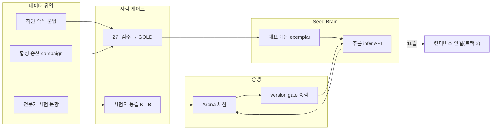

# 킨더브레인 통합 핸드북

> **한눈에 보기** — **킨더브레인은 유아교사의 평소 말투 한마디를 킨더버스의 기능·업무로 연결해 주는, 유아교육 특화 의도 판단 엔진이다.** 2026년 11월 킨더버스 오픈 **첫날부터** 교사가 "내 말을 알아듣는다"고 느끼게 하기 위해 지금 미리 구축·훈련하는 **선행 AI API**이며, 오픈 이후 실제 교사 데이터로 현장형 브레인으로 계속 성장한다.

이 핸드북은 기존 문서의 요약이 아니라, **저장소의 설계문서·코드·config·DB·테스트를 전수 조사해 "실제 구현된 킨더브레인"을 검증하며 쓴 문서**다(2026-07-17 기준). 모든 주요 주장에 `[근거: 파일::심볼]`이 붙고, 기능마다 상태 태그(IMPLEMENTED/PARTIAL/DESIGNED/PLANNED/BLOCKED/UNKNOWN)가 붙는다.

---

## 왜 지금 미리 만드는가

11월 오픈 후부터 데이터를 모으면 초기 교사는 몇 달간 미완성 AI의 훈련자가 된다. 그래서 두 트랙으로 나눈다:

- **트랙 1 · Pre-launch Kinder Brain (지금)** — 전문가·직원·검수자 데이터로 초기 뇌를 만들고 시험(KTIB·Arena)으로 증명 → 11월에 넘길 Seed Brain API
- **트랙 2 · Live KinderVerse (11월~)** — Seed Brain을 킨더버스에 연결, 실교사 발화·문맥·수정을 수집하되 **검수→시험→승격**을 거쳐서만 뇌를 갱신

상세: [02-two-track-strategy.md](02-two-track-strategy.md)

## 시스템 전체 그림

## 문서 목록과 권장 읽기 순서

**전체 이해 순서(처음 접하는 사람)**: 00 → 01 → 02 → 03 → 06 → 09 → 14

| # | 문서 | 내용 |
|---|---|---|
| 00 | 이 문서 | 시작 페이지·읽기 지도 |
| 01 | [킨더브레인 개요](01-kinder-brain-overview.md) | 무엇이고 무엇이 아닌가 (비기술자용) |
| 02 | [투트랙 전략](02-two-track-strategy.md) | 오픈 전/후 전략·타임라인 |
| 03 | [개념·용어집](03-concepts-and-glossary.md) | 전 용어 쉬운 설명 |
| 04 | [온톨로지와 70개 의도](04-ontology-and-intents.md) | 8영역·의도 전수 표·삼각지대 |
| 05 | [데이터 카탈로그](05-data-catalog.md) | 모든 데이터 종류·provenance |
| 06 | [데이터 생애주기](06-data-lifecycle.md) | 발화→GOLD→시험→승격 전 흐름 |
| 07 | [추론과 API](07-inference-and-api.md) | 전 엔드포인트·E2E 예시 6종 |
| 08 | [훈련과 자가 강화](08-training-and-self-improvement.md) | 자동 vs 인간 게이트 구분 |
| 09 | [평가와 성능](09-evaluation-and-performance.md) | 지표 정의·96%/2%의 정확한 의미 |
| 10 | [안전과 거버넌스](10-safety-and-governance.md) | 불변 원칙·DB CHECK·감사 |
| 11 | [운영 가이드](11-operations-guide.md) | 역할별 실전 매뉴얼 |
| 12 | [킨더버스 연동](12-kindervese-integration.md) | 11월 연결 설계·단계·3층 분리 |
| 13 | [가치와 경쟁력](13-value-and-competitive-advantage.md) | 사업적 관점 |
| 14 | [현재 상태와 로드맵](14-current-status-and-roadmap.md) | 실측 스냅샷·Must/Should |
| 15 | [FAQ와 오해](15-faq-and-misconceptions.md) | 자주 묻는 질문 |
| 16 | [소스 맵](16-source-map.md) | 개념→코드 색인 |
| 17 | [열린 질문과 갭](17-open-questions-and-gaps.md) | 정직한 미완·불일치 목록 |
| 18 | [문서 감사](18-documentation-audit.md) | 이 핸드북 자체의 검증 기록 |

## 직무별 권장 읽기 순서

| 직무 | 순서 | 이유 |
|---|---|---|
| 경영진·의사결정자 | 01 → 02 → 13 → 14 → 15 | 무엇·왜·가치·현재 위치·오해 방지 |
| 기획자·디자이너 | 01 → 03 → 04 → 12 → 15 | 개념·의도 체계·교사 경험 설계 |
| 백엔드·프론트 개발자 | 16 → 07 → 06 → 10 → 11(D) | 코드 색인부터 — 계약·흐름·불변 원칙 |
| 데이터·AI 담당자 | 05 → 06 → 08 → 09 → 17 | 데이터 규칙·파이프라인·지표·갭 |
| 검수자 | 03(용어) → 11(B) → 04(삼각지대) | 바로 실무 — blind 원칙과 GOLD 조건 |
| 운영자 | 11(E) → 09 → 14 → 17 | 버튼·지표·병목·리스크 |

## 이 핸드북의 사실성 원칙

1. 수치는 전부 **2026-07-17 실측**(활성 온톨로지·config·로컬 DB 읽기 전용 쿼리) — 기억·기존 문서 복사 금지.
2. 설계와 코드가 다르면 섞지 않고 **둘 다 표시**한다(17장에 모음).
3. 확인 못 한 것은 UNKNOWN으로 남긴다 — 그럴듯한 추측을 쓰지 않는다.

## 현재 상태 (요약 — 상세 14장)
- 온톨로지 onto-2.1 · 8영역 · **70의도** · 시험지 ktib-3 **386문항**(단, 8개 의도 집중) · GOLD 386(전부 시험지) · **대표 예문 0** · 뇌 점수 0.0%(정직한 0) vs 범용 베이스라인 88.1% · 혼동 가설 2,129개(07-20 Supabase 실측 — 증산이 계속 추가) · live 서빙 HOLD.

## 갱신 기록 (Change Log)
- **2026-07-22** — 합성 라벨 94% UNKNOWN의 원인 수리 반영: S7 프롬프트에 온톨로지 목록 미주입 + S6·S7 화면(workspace) 미전달이 §1-S6·S7 계약 위반이었음(실 LLM에서만 발현, mock은 가림). 코드가 계약에 맞게 수정되고 AC 3건이 프롬프트 조립을 잠금. 17장 C3(시드 의존 테스트 5건)도 자가 시드로 해소.
- **2026-07-20** — 스냅샷 이후 커밋 7건 + 운영 변화 반영: 화면 씨드·LLM 확장·씨드 스튜디오(05장 5-7·06장·11장 E-7·16장), atlas 원료 주입구 `mine_atlas`(11장 C·16장), Supabase 마이그레이션 0020 도달로 17장 C1 해소, **격리 테스트 DB(`TEST_DATABASE_URL`) 확립**(11장 D — 활성 DB로 스위트 금지)과 시드 의존 테스트 5건을 C3으로 신설, 07-20 Supabase 실측 스냅샷 추가(05장 5-7·14장 2-b — 07-17 로컬 팩트팩과 **출처가 다름**을 명시). 07-17 원 스냅샷 수치는 보존.
- **2026-07-17** — 최초 작성(19편, 저장소 전수 검증 기반).

## 주의사항
- 이 핸드북은 코드를 바꾸지 않는다 — 문서·다이어그램만 생성했다.
- 스냅샷 수치는 시간이 지나면 달라진다. 실시간 수치는 대시보드(BRAIN OPS)가 원천.

## 다음 단계
- 처음이라면 [01-kinder-brain-overview.md](01-kinder-brain-overview.md)부터.
- 지금 당장 프로젝트를 진전시키고 싶다면 [11-operations-guide.md](11-operations-guide.md)의 "공부 검수(2인 → GOLD)"가 현재 병목 해소 절차다.
