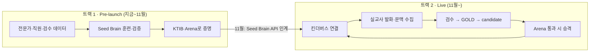
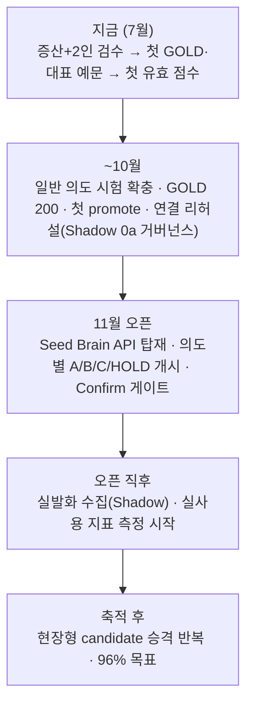

# 02. 투트랙 전략 — 오픈 전 선행 구축, 오픈 후 실사용 고도화

> **한눈에 보기** — 트랙 1(Pre-launch Kinder Brain)은 **지금** 실험실에서 전문가·직원·검수 데이터로 초기 뇌를 만들어 11월에 넘길 Seed Brain API를 완성하는 단계다. 트랙 2(Live KinderVerse)는 **11월 오픈 후** 그 뇌를 킨더버스에 연결해 실제 교사 데이터로 현장형 뇌로 키우는 단계다. 두 트랙은 순차가 아니라 **트랙 1의 산출물이 트랙 2의 초기 품질**이 되는 관계이며, 연결 준비(계약·문맥·정책)는 트랙 1과 병행한다. [근거: docs/06-runtime-integration/two-track-launch-plan-v0.1.md, docs/09-teacher-guide/internal-alignment.md]

---

## 1. 왜 투트랙인가 (콜드스타트 제거)

쉬운 설명: 식당을 열면서 "요리는 손님 오면 배우겠다"고 할 수는 없다. 11월 오픈 후부터 교사 데이터를 모아 뇌를 만들면 초기 교사는 혜택 없이 미완성 AI의 훈련자가 된다.

> 잘못된 접근: 11월 오픈 → 데이터 수집 시작 → 몇 달 뒤 의도 엔진 → 초기 교사는 혜택 없음
> 현재 접근: **오픈 전 뇌 사전 구축 → 11월 기본 의도 이해 API 탑재 → 첫날부터 혜택 → 실사용 데이터로 더 빠르게 고도화**

---

## 2. 트랙 1 — Pre-launch Kinder Brain (지금 ~ 11월)

| 항목 | 내용 |
|---|---|
| 목적 | 11월에 킨더버스가 붙일 **초기 의도 이해 API(Seed Brain)** 완성 |
| 대상 | 내부 — 전문가, 직원, 검수자 2인, 운영자 |
| 데이터 | 전문가 저작 시험 문항, 직원 즉석 문답, 2인 검수(GOLD), 합성 증산(campaign), 적대 혼동 가설(Skeptic) |
| 주요 기능 | 온톨로지(onto-2.1, 8영역 70의도) · 추론 API(mode=gym) · 즉석 문답 · 웹 2인 검수 · KTIB 동결 · Arena 채점 · version gate |
| 성공 기준(궁극) | KTIB first intent accuracy **96%** · 위험 오발률(CWAR) ≤ **2%** · CCC ≥ **80%** [근거: config/experiments.yaml::arena] |
| 11월 산출물 | 검증된 Seed Brain API + 동결 시험지 + 의도별 적용 등급표(제안) + 롤백 체계 |

### 트랙 1의 현재 BLOCKED 요소 (2026-07-17 실측)
| 병목 | 상태 | 이유 |
|---|---|---|
| TRAIN GOLD 0건 → **대표 예문 0** | BLOCKED(사람 게이트) | GOLD는 2인 검수로만 생성 — 검수 대기 91건+(증산 진행 중) [근거: DB 스냅샷, backend/app/aggregator/review.py] |
| 뇌 점수 0.0% | BLOCKED(위 항목 종속) | 대표 예문 0 → 전 문항 abstain. 채점 버튼도 이 상태를 감지해 비활성 [근거: backend/app/api/arena_ops.py::_blocked_reason] |
| KTIB 커버리지 8/70 의도 | PARTIAL | 시험지 386문항이 CRITICAL 7 + 1개 의도에 집중 — 62개 의도는 문항 0(측정 불가) [근거: ktib_items 실측] |
| brain_versions 비어 있음 | BLOCKED(GOLD 종속) | 승격 후보는 new GOLD ≥ 200에서 빌드(min_new_gold) [근거: config/experiments.yaml::version_gate] |

### 남은 작업 (요약 — 상세는 [14-current-status-and-roadmap.md](14-current-status-and-roadmap.md))
1. 증산 완료분 2인 검수 → 첫 TRAIN GOLD·대표 예문 → 첫 유효 채점
2. 일반 의도(62개) 시험 문항 확충 — 시험지 작성·CSV 업로드 경로
3. GOLD 200 도달 → 첫 candidate 뇌 → Arena 비교 → 첫 promote
4. 킨더버스 연결 준비(§5) 병행

---

## 3. 트랙 2 — Live KinderVerse (11월~)

| 항목 | 내용 |
|---|---|
| 목적 | 실제 교사 사용으로 현장 적합화 — 빠름·편리함·정확성·안전·만족도 |
| 대상 | 실제 교사 (킨더버스 사용자) |
| 데이터 | 실발화 + 실제 화면·선택 객체·직전 행동 + 교사의 선택·수정·작업 결과 |
| 원칙 | **수집은 실시간, 뇌 변경은 통제된 승격으로만** — 무검증 즉시 학습 없음 |

### 연결 단계 (전역 → 의도별 세분)
| 단계 | 내용 | 상태 |
|---|---|---|
| Shadow 0a | 추론 없이 실사용 발화·문맥 **로깅만**(분포 수집) — 거버넌스 7항목 게이트 통과 후 | DESIGNED [근거: docs/06-runtime-integration/README.md §2] |
| Shadow 0b | 뇌가 몰래 추론하되 교사에게 비노출 — 실제 선택과 비교 | DESIGNED |
| Suggest | 후보 2~4 제시 → "이 작업 하시려는 건가요?" → 선택이 교정 evidence로 | DESIGNED(코드 HOLD) |
| Assist | 정확·가역 의도는 바로 연결(열기·초안·검색) — 실행 계열은 확인 후 | DESIGNED(코드 HOLD) |
| Confirm 필수 | CRITICAL 7(학부모 발송·출결·삭제 등)은 성적 무관 미리보기+명시 확인 | DESIGNED — 계약상 `requires_confirmation`은 IMPLEMENTED |
| HOLD | 측정 미달 의도는 내부 추론만 | DESIGNED |

의도별 A/B/C/HOLD 등급 산정 규칙(Arena 실측 × 리스크 등급 × 데이터 규모의 읽기 전용 파생)은 [12-kindervese-integration.md](12-kindervese-integration.md)와 [근거: docs/06-runtime-integration/two-track-launch-plan-v0.1.md §2].

> **중요** — live rollout(Suggest/Assist/Auto) **코드는 현재 의도적으로 존재하지 않는다**(PARTIAL HOLD). infer는 mode=gym만 서빙하고 live/shadow 요청은 501을 반환한다. 이는 미구현이 아니라 게이트("KTIB 80% + 안전 지표") 전 구현 금지 정책이다. [근거: backend/app/api/infer.py::infer_endpoint, docs/06-runtime-integration/README.md]

### 트랙 2의 지속 고도화 구조
```
실시간 수집 → 개인정보·품질 검사 → AI 라벨 후보 → 인간 검수 → GOLD 축적
→ candidate brain → KTIB·Arena 평가 → 조건 통과 시에만 promote
```
"실시간으로 뇌가 고도화된다"는 말의 정확한 의미: **발화·정정은 실시간으로 수집되지만, 브레인의 변경은 검수와 평가를 통과한 뒤 통제된 방식으로만 이루어진다.**

### 교사 경험 성과 지표 (트랙 2에서 측정 시작)
- 첫 시도 연결률(교사가 고르지 않고 바로 맞음) · clarify율 · 교사 수정률 · 위험 오발(CWAR) 실측 · 작업 완료 시간 단축 — KTIB 점수와 병행 보고. [상태: PLANNED — 실사용 지표 수집 코드는 미구현]

---

## 4. 두 트랙의 관계 — 분리가 아니라 릴레이



- 트랙 1이 만드는 것은 데이터만이 아니다 — **측정 축(동결 시험지·베이스라인 88.1%)·검수 파이프라인·안전 게이트** 전부가 트랙 2에서 그대로 재사용된다.
- 애매 발화 리포트는 출처 축(gym=오픈 전 / live·shadow=오픈 후)을 처음부터 분리해 두어, 11월 후 같은 화면이 실교사 데이터로 이어진다. [근거: backend/app/api/observatory.py::ambiguity_report]

## 타임라인



## 현재 상태
- 트랙 1: IMPLEMENTED(파이프라인 전체) + BLOCKED(사람 검수 게이트 앞 대기).
- 트랙 2: 계약(ir-0.2)·전략 문서·리포트 출처 분리는 IMPLEMENTED, 서빙·Shadow·실사용 지표는 DESIGNED/PLANNED(코드 HOLD).

## 주의사항
- "트랙 2가 문서에만 있다"는 말은 절반만 맞다 — **연결 계약과 안전 신호는 이미 응답에 실려 있고**(risk_level 등), 서빙 코드만 게이트 뒤에 있다.
- 트랙 1 데이터의 한계(합성 편향·내부 표현 편향)를 잊지 말 것 — 그래서 트랙 2의 실발화가 반드시 필요하다.

## 다음 단계
- 오픈 최소 기준 9항목 체크리스트: [docs/09-teacher-guide/internal-alignment.md](../09-teacher-guide/internal-alignment.md) §2
- 연결 설계 상세: [12-kindervese-integration.md](12-kindervese-integration.md)
