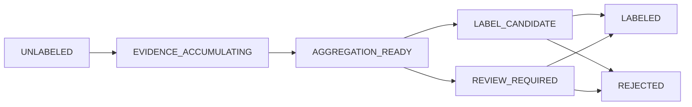

# 03. 개념·용어집 — 킨더브레인의 모든 말

> **한눈에 보기** — 킨더브레인에서 쓰는 용어 전부를 쉬운 한국어로 푼다. 용어마다 ① 한 줄 정의 ② 쉬운 비유 ③ 시스템에서의 역할 ④ 관련 파일 ⑤ 혼동 주의를 붙였다. 7개 묶음: **기본 개념 → 데이터 → 품질·검수 → 추론과 판단 → 평가 → 안전 → 연동**. 수치는 전부 2026-07-17 실측이며, 코드로 확인 못 한 것은 UNKNOWN으로 남겼다.

읽는 법: 처음이면 [01-kinder-brain-overview.md](01-kinder-brain-overview.md)를 먼저 읽고, 여기서는 모르는 용어가 나올 때마다 찾아보는 사전으로 쓰면 된다. 용어가 코드 어디에 사는지는 [16-source-map.md](16-source-map.md)가 표로 정리한다.

---

## 1. 기본 개념 — 시스템과 구성 요소

### Kinder Brain (킨더 브레인)
- **정의** — 유아교사의 짧고 애매한 발화 + 화면 컨텍스트 + 직전 행동 + 성향(Persona)으로 **의도를 추론하는 시스템 전체**(이 저장소, Kinder Intent Lab)의 이름.
- **비유** — 현장에 보내기 전에 학교에서 먼저 길러 두는, "교사 말귀를 알아듣는 신입 보조교사".
- **역할** — 5개 모듈의 총칭: Foundry(데이터 공장) / Seed Brain(추론 엔진) / Gym(훈련장) / Observatory(3D 뇌) / Arena(채점장).
- **파일** — [근거: CLAUDE.md], [근거: docs/00-overview/README.md]
- **혼동 주의** — Seed Brain은 그중 **추론 엔진 모듈 하나**다. Kinder Brain ⊃ Seed Brain.

### KinderVerse (킨더버스)
- **정의** — 킨더브레인이 연결될 **실서비스**(유아교육 플랫폼). 2026년 11월 오픈 예정.
- **비유** — 브레인이 졸업 후 일하게 될 실제 직장.
- **역할** — 트랙 2(오픈 후)에서 실교사 발화·문맥을 공급하고, 추론된 의도를 실제 기능으로 실행하는 표면. 지금은 API 계약(infer 스키마)만 맞춰 두고 서빙 코드는 만들지 않는다(PARTIAL HOLD).
- **파일** — [근거: CLAUDE.md], [근거: docs/06-runtime-integration/two-track-launch-plan-v0.1.md]
- **혼동 주의** — 이 저장소(Kinder Intent Lab)는 킨더버스와 **분리된 실험실**이다. 여기서 한 훈련이 실서비스에 바로 반영되지 않는다.

### Seed Brain (시드 브레인)
- **정의** — 실사용 데이터가 아직 없을 때 합성·전문가 데이터로 채워 만드는, **내부가 들여다보이는(블랙박스 금지) 의도 추론 엔진**.
- **비유** — 실전 경험 전에 교과서와 모의고사로 공부시킨 수험생.
- **역할** — `POST /v1/intent/infer`의 두뇌. retrieval → LLM scorer → prior 재정렬 → 정규화의 4단계 파이프라인 [근거: backend/app/brain/inference.py].
- **파일** — [근거: backend/app/brain/inference.py::infer], [근거: docs/01-foundry/kinder-intent-foundry-growth-system-v1.0.md §5]
- **혼동 주의** — `seed-v0`는 "아직 한 번도 promote(승격)된 버전이 없을 때"의 기준 이름이다 [근거: backend/app/brain/version_gate.py::SEED_VERSION]. 현재 뇌가 seed-v0이며 첫 채점 0.0%(대표 예문 0개라 전부 abstain — 정직한 0)였다 [근거: 2026-07-17 DB 실측].

### ontology (온톨로지)
- **정의** — 이 시스템이 인식하는 **의도의 공식 사전**: 8개 domain 아래 70개 intent, 각각 정의·긍정/부정 예시·혼동 후보를 담은 YAML.
- **비유** — 국어사전 — 사전에 없는 말은 공식적으로 "아는 말"이 아니다.
- **역할** — 의미 구조의 유일한 권한(§5-9). 현재 버전 onto-2.1, intent 70개(UNKNOWN 제외), 긍정 예시 419개 [근거: seeds/ontology_v1.yaml 실측].
- **파일** — [근거: seeds/ontology_v1.yaml], [근거: backend/app/core/ontology.py::load_ontology]
- **혼동 주의** — 위험 등급(risk model)은 온톨로지에 넣지 않는다 — 등급은 의미가 아니라 평가 정책이라서다 [근거: backend/app/core/risk_model.py 모듈 docstring]. 상세 목록은 [04-ontology-and-intents.md](04-ontology-and-intents.md).

### taxonomy (택소노미)
- **정의** — 항목을 위계(상위→하위)로 나누는 **분류 체계**를 가리키는 일반 용어.
- **비유** — 도서관의 십진분류표.
- **역할** — 이 프로젝트에서는 같은 것을 **ontology**라고 부른다(domain → intent 2계층). 코드·문서에 `taxonomy`라는 심볼은 없다(전수 grep 확인).
- **파일** — [근거: backend/app/core/ontology.py — "domain → intent 2계층"]
- **혼동 주의** — 외부 자료의 "intent taxonomy"를 만나면 이 저장소의 ontology와 같은 개념으로 읽으면 된다.

### intent (의도)
- **정의** — 교사 발화가 원하는 **작업 한 단위**의 표준 이름 (예: `op_attendance_record` = 출석 기록).
- **비유** — 식당 메뉴판의 메뉴 항목 — 손님 말은 제각각이어도 주문은 메뉴 중 하나로 접수된다.
- **역할** — 추론의 최종 출력 단위이자 3D 뇌 노드 1개와 1:1. 70개 + 특수값 `UNKNOWN`(미분류 풀, domain 없음).
- **파일** — [근거: seeds/ontology_v1.yaml], [근거: backend/app/core/ontology.py::UNKNOWN_INTENT_ID]
- **혼동 주의** — `intent_id`는 어떤 관리 화면에서도 수정 불가(불변 키). 한글 이름은 별도 표시 계층(intent_display)이 담당한다 [근거: backend/app/api/ontology_admin.py].

### domain / region (영역)
- **정의** — 온톨로지의 상위 8분류: `PLAY, OBSERVATION, DOCUMENT, VISUAL, COMMUNICATION, OPERATION, REFLECTION, STUDIO`.
- **비유** — 뇌의 영역(언어 영역·시각 영역처럼) — 비슷한 일이 모여 사는 구역.
- **역할** — 데이터 배분(campaign domain_weights)·3D 배치·region별 점수 집계의 축. 순서는 3D 좌표계와 1:1이라 재배열 금지 [근거: backend/app/core/ontology.py::CANONICAL_DOMAINS].
- **파일** — [근거: backend/app/core/ontology.py::CANONICAL_DOMAINS], [근거: frontend/src/brain3d/regions.ts]
- **혼동 주의** — 같은 8분류를 온톨로지·에피소드에서는 **domain**, 3D 뇌 테이블에서는 **region**(`brain_nodes.region`)이라 부른다 [근거: backend/app/models/brain.py::BrainNode].

### Atlas (교사 언어 지도)
- **정의** — 교사들이 실제로 쓰는 발화 패턴을 모은 **표현 지도**(Teacher Language Atlas).
- **비유** — "이 동네 사람들이 실제로 쓰는 말투"를 모은 방언 지도.
- **역할** — 신규 발화가 기존 패턴에 매핑되는 비율(coverage, 임베딩 유사도 ≥ `atlas.map_min_similarity`=0.85)을 재고, 미매핑 발화를 확장 큐로 보낸다.
- **파일** — [근거: backend/app/foundry/atlas.py::compute_coverage]
- **혼동 주의** — 현재 `atlas_entries`는 0건이다(코드는 있으나 지도 데이터가 아직 비어 있음) [근거: 2026-07-17 DB 실측]. ontology(의도 사전)와 다르다 — Atlas는 "말투" 사전이다.

### Foundry (파운드리, 데이터 공장)
- **정의** — 합성 훈련 데이터를 만드는 **13단계 생산 라인**(S1 소스 발굴 ~ S13 Seed Brain Backfill).
- **비유** — 원재료(교육과정 문서 등)를 들여와 검사·가공·품질검사까지 하는 공장.
- **역할** — S1 discovery → S2 governance → S3 extractor → S4 language miner → S5 situation builder → S6 simulator → S7 analyst → S8 skeptic → S9 judge → S10 consensus … → S13 backfill.
- **파일** — [근거: backend/app/foundry/stages/], [근거: backend/app/foundry/pilot.py::run_pilot]
- **혼동 주의** — Foundry 산출물(합성)은 **시험지(KTIB)에 절대 못 들어간다**(절대 규칙 2). 훈련 재료만 만든다.

### Arena (아레나, 채점장)
- **정의** — 동결된 시험지(KTIB) 위에서 Seed Brain을 채점하는 **유일한 심판**.
- **비유** — 공인 시험장 — 여기 점수만 성적표(밝기)에 반영된다.
- **역할** — 노드/region/global 정확도, 방향성 confusion matrix, calibration(ECE)을 산출하고 replay 무결성 4버전(model/ontology/persona_state/extractor)을 기록한다.
- **파일** — [근거: backend/app/arena/runner.py::run_arena], [근거: backend/app/api/arena_ops.py — POST /v1/observatory/arena/run]
- **혼동 주의** — 훈련(Gym)은 밝기를 절대 못 바꾼다. **밝기의 원천은 Arena뿐**(절대 규칙 3).

### Growth Loop (성장 루프)
- **정의** — "클릭 → 진단 → 전략 → 훈련 → 검증 → 성장"의 강화 사이클(§6). 전체 나침반은 End-to-End Trace [0]~[9].
- **비유** — 건강검진 → 처방 → 운동 → 재검진의 반복.
- **역할** — 어두운 노드를 클릭해 약점을 진단하고, 훈련으로 evidence를 쌓고, version gate → Arena → promote로 검증된 성장만 반영한다.
- **파일** — [근거: backend/app/gym/growth.py], [근거: backend/tests/test_e2e_trace_0_to_9.py]
- **혼동 주의** — 루프의 어느 단계도 밝기를 직접 올리는 지름길이 없다 — 밝기는 마지막 promote에서만 켜진다 [근거: backend/app/arena/reflect.py 모듈 docstring].

### Backfill (백필)
- **정의** — 검수 완료된 데이터를 뇌 속 재료로 옮겨 담는 단계(S13): 노드 부트스트랩 + 대표 예문(exemplar) 선정 + evidence 통계 집계.
- **비유** — 합격 판정 난 교재만 골라 서가(뇌)에 꽂는 사서.
- **역할** — GOLD∧LABELED 에피소드에서만 exemplar를 뽑고(중복 임베딩 거리 ≥ `brain.exemplar_min_dist`=0.15), 웹 검수 적용 성공 시 자동 체인으로도 돈다.
- **파일** — [근거: backend/app/brain/backfill.py::run_backfill], [근거: backend/app/api/review.py — 적용 성공 시 run_backfill 체인]
- **혼동 주의** — BRONZE/SILVER(분포 라벨)는 evidence 통계에만 반영되고 exemplar로는 절대 채택되지 않는다 [근거: backend/app/brain/backfill.py 모듈 docstring].

### campaign (캠페인, 증산)
- **정의** — 10k~30k 규모 합성 데이터 **대량 생산 오케스트레이터** — 도메인 배분 + 주간 품질 리포트 + 악화 시 자동 중단.
- **비유** — 공장의 대량 생산 라인 가동 계획서 — 불량률이 오르면 라인을 세운다.
- **역할** — `campaign.domain_weights`(DOCUMENT·VISUAL 각 0.22 우선)로 배분하고, `window_batches`=4 배치마다 합의도 하락(>0.15)·reject율 상승(>0.15)·단가 상승(>25%) 중 하나라도 악화하면 중단. 2026-07-17 실 LLM 가동 중(400+340건, 에피소드당 약 $0.071 실측).
- **파일** — [근거: backend/app/foundry/campaign.py::run_campaign], [근거: scripts/run_campaign.py]
- **혼동 주의** — pilot(500건 게이트 검증)과 다르다 — campaign은 pilot이 세운 기준선 대비 악화를 감시하며 도는 **양산** 단계다.

### Skeptic (스켑틱, 회의론자)
- **정의** — Foundry S8 에이전트 — Analyst의 해석에 **일부러 반대**하며 "이 발화, 저 의도랑 헷갈리지 않아?" 하고 혼동 후보 쌍을 제시한다.
- **비유** — 회의에서 일부러 반대 의견을 내는 악마의 변호인(devil's advocate).
- **역할** — confusion edge의 최초 공급자. Skeptic이 낸 쌍은 `state=hypothesized`로 적재된다. 현재 629개 edge 전부가 SKEPTIC 기원 [근거: 2026-07-17 DB 실측].
- **파일** — [근거: backend/app/foundry/stages/s8_skeptic.py::record_confusion_edges]
- **혼동 주의** — Skeptic의 쌍은 **가설**일 뿐이다. 확정(confirmed)은 Arena 실측만 할 수 있다.

### confusion edge (혼동 간선)
- **정의** — "정답이 A인데 B로 예측한다"는 **방향성 있는** 혼동 관계 1건. (A→B)와 (B→A)는 다른 edge다.
- **비유** — "당근"과 "당면"을 헷갈리는 방향별 오답 노트.
- **역할** — 3D 뇌에서 노드 사이 깜빡이는 선(Edge Flicker = confusion_rate)으로 렌더되고, C형 강화 훈련(`growth.confusion_trigger`=0.25)의 발동 조건이다.
- **파일** — [근거: backend/app/models/brain.py::ConfusionEdge], [근거: frontend/src/brain3d/ConfusionEdgeLayer.tsx]
- **혼동 주의** — origin 4종(SKEPTIC/CONSENSUS_DISAGREEMENT/GYM_CORRECTION/ARENA_MATRIX) 중 생성 경로 구현: SKEPTIC(가설 생성), **GYM_CORRECTION(즉석 문답 교정 시 정답→추측 가설 — 2026-07-17 배선** [근거: backend/app/gym/live.py::record_training_feedback]**)**, ARENA_MATRIX(확정). CONSENSUS_DISAGREEMENT는 에피소드의 disagreement_pairs 기록까지만(생성 경로 없음), `observed` 상태 전이 경로 미확인. PARTIAL

### hypothesized / observed / confirmed (가설/관측/확정)
- **정의** — confusion edge의 3단계 상태: 가설(누군가 의심) → 관측(실제 목격) → 확정(반복 실측).
- **비유** — 소문 → 목격담 → 판결.
- **역할** — Arena에서 같은 오답 쌍이 `arena.confusion_confirm_min`=3회 이상 나오면 `confirmed`로 승격된다 [근거: backend/app/arena/runner.py::apply_confusion_edges]. confirmed cross-region edge는 성장 Stage 4 판정의 "인접" 신호다.
- **파일** — [근거: backend/app/models/brain.py — CheckConstraint state IN (...)]
- **혼동 주의** — 중간 단계 `observed`로 올리는 코드 경로는 현재 확인되지 않았다(생성=hypothesized, 확정=confirmed만 구현). UNKNOWN

---

## 2. 데이터 — 에피소드와 그 신분증

### episode (에피소드)
- **정의** — 교사 발화 1건 + 그 상황(화면·시나리오) + 라벨 관련 상태를 담는 **데이터의 기본 단위**. 현재 2,729건.
- **비유** — 시험 문제 카드 1장 — 문제(발화), 출제 맥락, 채점 상태가 함께 적혀 있다.
- **역할** — 훈련 재료(TRAIN)이자 시험 문항 원본(BENCHMARK_HOLDOUT). `teacher_prompt`(발화)·`label_distribution`(라벨 분포)·split·tier·state를 가진다.
- **파일** — [근거: backend/app/models/episodes.py::Episode], [근거: schemas/episode.schema.json]
- **혼동 주의** — 에피소드 자체는 "정답 확정"이 아니다 — 확정은 label_state=LABELED가 말한다.

### evidence (증거)
- **정의** — "이 에피소드의 의도는 X다(또는 아니다)"라는 **신호 1건**. 현재 3,529건.
- **비유** — 재판의 증거물 — 하나로는 판결 못 하고 여러 개를 모아 평가한다.
- **역할** — polarity(supports/refutes)·strength(0~1)·evidence_type(6종: SYNTHETIC_CONSENSUS, WEAK_BEHAVIORAL, DOMAIN_RULE, HUMAN_CORRECTION, HUMAN_CONFIRMATION, EXPERT_REVIEW)·actor_type을 갖고 Label Aggregator의 입력이 된다.
- **파일** — [근거: backend/app/models/episodes.py::Evidence], [근거: backend/app/aggregator/aggregator.py::aggregate]
- **혼동 주의** — evidence_type에 **고정 서열은 금지**다(절대 규칙 10) — 가중치는 config(`label_aggregator.evidence_type_weights`)가 준다.

### provenance 4필드 (출처 신분증)
- **정의** — "이 데이터가 어디서 왔나"를 역추론 없이 기록하는 4개 필드(절대 규칙 9).
- **비유** — 식품 이력제 라벨 — 산지·가공자·원료·검사자를 각각 따로 적는다.
- **역할** — ① `origin_channel`(유입 채널: FOUNDRY_SYNTHETIC/FOUNDRY_AUGMENTED/GYM_HUMAN/EXPERT_AUTHORED/PRODUCTION_SHADOW/OFFICIAL_CORPUS/COMMUNITY_DERIVED) ② `episode_creator_type`(에피소드 제작 주체) ③ `primary_subject_type`(발화 주인공이 실교사인가: TEACHER/SIMULATED_TEACHER) ④ `evidence.actor_type`(신호를 만든 행위자 6종).
- **파일** — [근거: backend/app/models/episodes.py — CheckConstraint 4종]
- **혼동 주의** — 생성 주체를 evidence에서 **역추론하면 안 된다** — 필드에 적힌 값만이 출처다.

### label_state (라벨 상태)
- **정의** — 에피소드가 라벨 확정 **워크플로의 어디에 있는지**를 나타내는 상태(7종).
- **비유** — 택배 배송 상태(접수→이동중→배송완료) — 물건의 품질과는 다른 축이다.
- **역할** — 전이는 `advance_label_state()` 단일 경로만 허용(건너뛰기 금지):

- **파일** — [근거: backend/app/aggregator/state_machine.py::ALLOWED_TRANSITIONS]
- **혼동 주의** — reliability_tier(품질)와 **절대 혼용 금지**(절대 규칙 8). "상태가 LABELED"와 "품질이 GOLD"는 다른 문장이다.

### EVIDENCE_ACCUMULATING (신호 축적 중)
- **정의** — 신호(evidence)가 아직 최소 개수(`label_aggregator.min_label_functions`=2)에 못 미쳐 기다리는 상태. 현재 23건.
- **비유** — 심사위원 2명이 모일 때까지 대기 중인 참가자.
- **역할** — 즉석 문답 등에서 첫 신호를 받은 에피소드가 두 번째 신호(2인 일치 경로)를 기다리는 자리 [근거: backend/app/gym/live.py 모듈 docstring].
- **파일** — [근거: backend/app/aggregator/state_machine.py]
- **혼동 주의** — "버려진" 상태가 아니다 — 신호가 도달하면 자동으로 다음 단계로 전이한다.

### LABEL_CANDIDATE (라벨 후보)
- **정의** — Aggregator 자동 게이트를 통과해 **사람 검수를 기다리는** 상태. 현재 91건(증산 진행 중이라 증가).
- **비유** — 서류 심사 합격 후 면접 대기자.
- **역할** — 웹 공부검수(`/v1/review`)와 YAML 검수(run_human_review)의 대상 상태(REVIEW_REQUIRED와 함께 REVIEWABLE_STATES).
- **파일** — [근거: backend/app/aggregator/review.py::REVIEWABLE_STATES]
- **혼동 주의** — 여기서 LABELED로 가는 문은 **사람 검수뿐**이다 — 자동 승격 경로가 없다.

### LABELED (라벨 확정)
- **정의** — 사람 검수를 거쳐 정답이 확정된 **종착(terminal) 상태**. 현재 386건.
- **비유** — 판결 확정 — 더 이상 상태가 바뀌지 않는다.
- **역할** — GOLD의 전제 조건(`gold_requires_labeled` CHECK)이자 시험지(KTIB) 자격 요건의 하나.
- **파일** — [근거: backend/app/models/episodes.py — gold_requires_labeled], [근거: db/migrations/versions/0002_gold_requires_labeled.py]
- **혼동 주의** — LABELED여도 tier가 GOLD가 아닐 수 있다(이론상) — 상태와 품질은 별개 축이다.

### REJECTED (폐기)
- **정의** — 사람이 "이 에피소드는 못 쓴다"고 판정한 종착 상태. 현재 2,229건.
- **비유** — 불합격 도장 — 기록은 남지만 재사용하지 않는다.
- **역할** — 검수 불능 mock 자리표시자 2,002건 일괄 정리(2026-07-17, 거버넌스 기록)로 대부분을 차지한다 [근거: scripts/cleanup_mock_bank.py].
- **파일** — [근거: backend/app/aggregator/state_machine.py]
- **혼동 주의** — 삭제가 아니다 — 행은 남아 있고 학습·시험 어디에도 안 들어갈 뿐이다.

### reliability_tier (신뢰 등급)
- **정의** — 에피소드 라벨의 **품질 등급** 4단: UNVERIFIED → BRONZE → SILVER → GOLD.
- **비유** — 원석 감정 등급 — 배송 상태(label_state)와는 무관한 품질 축.
- **역할** — 어떤 용도로 쓸 수 있는지 결정한다(GOLD만 exemplar·KTIB·version gate 카운트).
- **파일** — [근거: backend/app/models/episodes.py — CheckConstraint reliability_tier], [근거: backend/app/models/guards.py::promote_tier]
- **혼동 주의** — 절대 규칙 8: label_state와 혼용하지 않는다.

### GOLD (골드)
- **정의** — **서로 다른 검수자 2인 이상이 같은 의도로 일치**(일치도 기록)해 확정된 최고 등급. 현재 386건 — 전부 시험지(BENCHMARK)이고 훈련(TRAIN) GOLD는 0건.
- **비유** — 공인 감정서가 붙은 진품.
- **역할** — 세 곳으로 흘러간다: exemplar(추론 재료) · version gate의 new_gold(성장 트리거) · KTIB(시험 문항). 승격의 **유일한 문**은 `apply_review_batch`다.
- **파일** — [근거: backend/app/aggregator/review.py::apply_review_batch], [근거: config/experiments.yaml — review.min_reviewers=2]
- **혼동 주의** — 합성 에피소드도 GOLD가 될 수 있다(exemplar·new_gold용). 다만 origin이 합성이면 `benchmark_integrity` CHECK가 시험지 진입만은 물리적으로 막는다.

### SILVER (실버)
- **정의** — 자동 집계(Aggregator)가 올릴 수 있는 **최고** 등급. 현재 1,166건.
- **비유** — 기계 검수 합격품 — 사람 감정은 아직 안 받았다.
- **역할** — Aggregator의 `recommend_tier`는 GOLD를 절대 반환하지 않는다 — 사람 없이 GOLD가 생기는 길을 차단 [근거: backend/app/aggregator/review.py 모듈 docstring].
- **파일** — [근거: backend/app/aggregator/aggregator.py::recommend_tier]
- **혼동 주의** — SILVER는 훈련 통계에는 쓰이지만 exemplar·KTIB에는 못 들어간다.

### BRONZE (브론즈)
- **정의** — 신호가 있으나 신뢰가 낮은 분포 라벨 등급. 현재 1,154건.
- **비유** — 참고용 견본품.
- **역할** — evidence 통계(노드 size/density)에만 반영된다 — exemplar 채택 금지 [근거: backend/app/brain/backfill.py 모듈 docstring].
- **파일** — [근거: backend/app/aggregator/aggregator.py]
- **혼동 주의** — BRONZE≠나쁜 데이터 — "아직 확신이 약한" 데이터다.

### UNVERIFIED (미검증)
- **정의** — 갓 태어난 에피소드의 기본 등급(server_default). 현재 23건.
- **비유** — 아직 감정 안 받은 신상품.
- **역할** — 신호가 쌓이며 BRONZE 이상으로 올라간다.
- **파일** — [근거: backend/app/models/episodes.py — server_default 'UNVERIFIED']
- **혼동 주의** — label_state의 UNLABELED(상태)와 짝처럼 보이지만 서로 다른 축의 값이다.

### TRAIN (훈련 풀)
- **정의** — 학습에 쓰는 dataset_split. 현재 2,343건.
- **비유** — 문제집 — 마음껏 풀고 오답도 남긴다.
- **역할** — exemplar·evidence 집계·version gate 카운트는 전부 이 풀에서만(`training_gold()`가 벤치마크를 제외).
- **파일** — [근거: backend/app/core/datasets.py::training_gold], [근거: backend/app/brain/version_gate.py::count_gold]
- **혼동 주의** — split에는 VALIDATION·TEST도 스키마상 존재한다(현재 주 사용은 TRAIN/BENCHMARK_HOLDOUT).

### BENCHMARK_HOLDOUT (시험 풀)
- **정의** — 시험(KTIB) 전용으로 **격리**된 dataset_split. 현재 386건.
- **비유** — 금고에 봉인된 수능 문제지 — 학습이 훔쳐볼 수 없다.
- **역할** — 진입 조건이 DB CHECK로 강제된다: GOLD ∧ LABELED ∧ 비합성 채널(절대 규칙 2).
- **파일** — [근거: backend/app/models/episodes.py — benchmark_integrity CHECK]
- **혼동 주의** — 같은 발화가 TRAIN과 여기에 동시에 있으면 오염이다 — expert ingest가 해시로 차단한다 [근거: backend/app/foundry/expert_ingest.py 모듈 docstring].

### exemplar (대표 예문)
- **정의** — 노드(의도)마다 두는 **대표 에피소드의 임베딩** — 추론 1단계 retrieval의 검색 재료.
- **비유** — 단어 카드 앞면의 대표 예문 — 새 발화가 오면 이 카드들과 비교한다.
- **역할** — GOLD∧LABELED에서만 선정, 기존 exemplar와 임베딩 거리 ≥ 0.15(중복 다양성 부풀리기 방지). **현재 0건 — seed-v0가 0.0%(전부 abstain)인 직접 원인.**
- **파일** — [근거: backend/app/models/brain.py::Exemplar], [근거: backend/app/brain/backfill.py::select_exemplars]
- **혼동 주의** — 온톨로지 YAML의 positive_examples(사전 예시)와 다르다 — exemplar는 검수 통과한 **실데이터**에서만 나온다.

### embedding (임베딩)
- **정의** — 문장을 의미 좌표(숫자 벡터 1,536차원)로 바꾼 것 — 비슷한 뜻이면 가까운 좌표.
- **비유** — 문장마다 지도 위 GPS 좌표를 찍는 것.
- **역할** — retrieval 유사도·중복 판정(dedup 0.92)·Atlas 매핑·exemplar 거리 등 모든 "비슷함" 계산의 기반. provider는 env(`EMBEDDING_PROVIDER`, 기본 mock)로 주입.
- **파일** — [근거: backend/app/llm/openai_embedding_provider.py], [근거: .env.example — EMBEDDING_DIM=1536]
- **혼동 주의** — 완성(completion) LLM과 임베딩은 **별도 provider**다(LLM_PROVIDER ≠ EMBEDDING_PROVIDER).

### dedup_hash (중복 방지 해시)
- **정의** — 같은 데이터가 두 번 들어오는 것을 막는 지문(해시) — episodes에 유일 인덱스(NULL 제외).
- **비유** — 입장 도장 — 같은 손등에 두 번 찍히지 않는다.
- **역할** — 배치 재시작 멱등성 보장. 전문가 유입은 "발화+intent"로 해시하되 **split은 넣지 않는다** — 넣으면 같은 발화가 훈련·시험 양쪽에 존재할 수 있게 되기 때문 [근거: backend/app/foundry/expert_ingest.py::_dedup_hash].
- **파일** — [근거: backend/app/models/episodes.py — idx_episodes_dedup_hash]
- **혼동 주의** — 해시가 없는(NULL) 행도 존재 가능 — 유일성은 "있는 값끼리"만 강제된다.

### atlas expansion queue (아틀라스 확장 큐)
- **정의** — 기존 패턴/의도로 분류 못 한 발화·새 의도 제안이 줄 서는 **대기열**(status: PENDING/CLUSTERED/DISMISSED). 현재 0건.
- **비유** — 사전 편찬부의 "신조어 제보함".
- **역할** — 즉석 문답에서 "진짜 새 의도" 제안이 오면 여기 PENDING으로만 등록한다 — **brain_nodes 자동 생성 금지**(절대 규칙 4).
- **파일** — [근거: backend/app/gym/live.py::register_atlas_suggestion], [근거: backend/app/models/foundry.py::AtlasExpansionEntry]
- **혼동 주의** — 큐 등록 ≠ 의도 신설. 신설은 거버넌스 승인 플로우(온톨로지 버전 업)로만 된다.

---

## 3. 품질·검수 — 사람 게이트

### HUMAN_CONFIRMATION (사람 확인)
- **정의** — 뇌의 추측과 사람 판정이 **일치**했음을 기록하는 evidence_type. 현재 50건.
- **비유** — "네 답 맞아" 도장.
- **역할** — 즉석 문답·Gym(guess_my_intent 등)에서 생성 [근거: backend/app/gym/evidence.py::_MODE_EVIDENCE_TYPE].
- **파일** — [근거: backend/app/gym/live.py::record_training_feedback]
- **혼동 주의** — 확인이어도 밝기는 안 변한다 — evidence 카운트(size/density)와 pending 링만 변한다.

### HUMAN_CORRECTION (사람 교정)
- **정의** — 뇌가 틀렸거나 답을 못 냈을 때 사람이 정답을 잡아 준 evidence_type — **가장 강한 인간 신호**. 현재 13건.
- **비유** — 빨간 펜 첨삭.
- **역할** — 교정 당시 뇌의 추측은 `evidence.context.brain_guess`에 남아 애매 발화 리포트의 원천이 된다 [근거: backend/app/api/observatory.py — AmbiguityCorrection].
- **파일** — [근거: backend/app/gym/live.py], [근거: backend/app/brain/backfill.py — HUMAN_CORRECTION도 human_confirmed 버킷]
- **혼동 주의** — 교정 즉시 반영되는 것은 evidence·통계뿐 — 개인 prior 조정은 Fast Update 배치가 따로 한다.

### live quiz (즉석 문답)
- **정의** — 자유 발화를 타이핑 → 뇌의 라이브 추측(3~4 후보) → 사람이 판정하는 **1문 1답 훈련·출제 도구**.
- **비유** — 선생님이 즉석에서 내는 쪽지 시험 + 즉석 채점.
- **역할** — 판정은 `POST /v1/gym/live/feedback`으로 들어와 확인/교정 evidence가 된다. `purpose=benchmark`(출제용)면 **DB에 아무것도 쓰지 않고** 2차 검수 YAML 큐에만 줄 세운다(학습/시험 분리).
- **파일** — [근거: backend/app/gym/live.py], [근거: frontend/src/panels/LiveQuizPanel.tsx]
- **혼동 주의** — 출제 큐에는 뇌의 추측을 기록하지 않는다 — 2차 검수자가 앵커링되면 독립 검수가 아니기 때문 [근거: backend/app/gym/live.py 모듈 docstring].

### Cohen's kappa (코헨 카파)
- **정의** — 두 검수자의 일치도를 **우연히 맞을 확률을 빼고** 재는 통계량(1=완전 일치, 0=우연 수준).
- **비유** — 둘 다 "찍어도 반은 맞는" 시험에서, 찍기 실력을 빼고 진짜 합의만 재는 채점.
- **역할** — GOLD 배치 게이트: 검수자 쌍 kappa ≥ `review.min_agreement_kappa`=0.65 미달이면 **배치 전체 거부**. 계산 불가(모두 한 라벨만)도 거부 [근거: backend/app/aggregator/review.py::batch_kappa].
- **파일** — [근거: backend/app/aggregator/review.py::cohens_kappa]
- **혼동 주의** — O/X처럼 판정이 한쪽으로 쏠리면 kappa가 base-rate 역설로 퇴화한다 — 실측: 210문항 일치 95.7%인데 kappa −0.02. 그래서 agreement_rate가 대체 인증으로 추가됐다(§3-3 v1.6).

### agreement_rate (관측 일치율)
- **정의** — 두 검수자가 실제로 같은 판정을 낸 **단순 비율** — O/X 승인형 검수의 대체 인증 척도.
- **비유** — 100문제 중 몇 문제에서 둘의 채점이 같았나.
- **역할** — kappa가 퇴화하는 경우 `agreement_rate ≥ review.min_expert_agreement`=0.80이면 시험지 인증 통과(OR 조건). ktib_uploads에 kappa와 함께 보관.
- **파일** — [근거: backend/app/foundry/expert_ingest.py — agreement_rate 게이트], [근거: backend/app/models/arena.py::KtibUpload.agreement_rate]
- **혼동 주의** — kappa의 대체가 아니라 **보완**이다 — blind 독립 라벨링 경로는 여전히 kappa를 쓴다.

### governance event (거버넌스 이벤트)
- **정의** — "누가 무엇을 승인해서 시스템이 바뀌었나"를 남기는 **감사 로그** (governance_events 테이블).
- **비유** — 회사의 결재 서류철.
- **역할** — 노드 생성·전문가 유입·리스크 모델 개정·표시 수정 등 승인 행위마다 1건. 실측 7종 43건(SOURCE_DECISION 32, EXPERT_EPISODE_INGEST 3, NODE_REGION_MOVE 2, INTENT_DISPLAY_BULK_EDIT 2, NODE_BOOTSTRAP 2, MOCK_BANK_CLEANUP 1, RISK_MODEL_UPDATE 1).
- **파일** — [근거: backend/app/models/governance.py::GovernanceEvent]
- **혼동 주의** — brain_nodes는 governance 이벤트를 남기는 승인 플로우로만 생긴다(절대 규칙 4) — 자동 INSERT는 어디에도 없다.

### benchmark_integrity (벤치마크 무결성 CHECK)
- **정의** — `BENCHMARK_HOLDOUT ⇒ GOLD ∧ LABELED ∧ origin_channel ∉ {FOUNDRY_SYNTHETIC, FOUNDRY_AUGMENTED}`를 DB가 직접 강제하는 CHECK 제약 — 절대 규칙 2의 물리적 구현.
- **비유** — 금고 문에 박힌 자물쇠 — 규칙을 아는 사람이 아니라 문 자체가 막는다.
- **역할** — 코드에 버그가 있어도 합성·미검증 데이터가 시험지에 들어가는 순간 DB가 거부한다.
- **파일** — [근거: backend/app/models/episodes.py — CheckConstraint name="benchmark_integrity"]
- **혼동 주의** — 앱 레벨 가드(guards.py)와 별개의 최종 백스톱이다 — 우회 코드 작성 금지.

### PIN (핀, 기본 2341)
- **정의** — 웹의 채점 실행·온톨로지 표시 수정 버튼에 걸린 4자리 비밀번호 — **오클릭 방지 자물쇠**(보안장치 아님).
- **비유** — 전자레인지의 "길게 눌러 시작" — 실수 방지용.
- **역할** — env `ARENA_PIN`(채점)·`ONTOLOGY_PIN`(의도 관리, 미설정 시 ARENA_PIN 폴백), 기본값 2341. 비교는 `hmac.compare_digest`.
- **파일** — [근거: backend/app/api/arena_ops.py::_pin], [근거: backend/app/api/ontology_admin.py::_pin]
- **혼동 주의** — 인증 시스템이 아니다 — 배포 서버에서는 값을 바꾸는 것을 권장하지만, 진짜 접근 통제는 별도 문제다.

---

## 4. 추론과 판단 — 발화 한 줄이 들어오면

### inference (추론)
- **정의** — 발화+컨텍스트를 받아 의도 후보와 판단을 내는 **4단계 파이프라인**: [1] retrieval(exemplar·Atlas 검색) → [2] LLM scorer(후보별 활성도) → [3] prior 재정렬(persona 곱) → [4] 정규화(confidence·margin).
- **비유** — ① 비슷한 기출 찾기 → ② 채점위원 평가 → ③ 수험생 성향 반영 → ④ 순위표 작성.
- **역할** — `POST /v1/intent/infer`(mode=gym만 서빙, 그 외 501). 4단계 기여는 inference_logs.stages에 분리 기록. 실측 로그: arena 756건, gym 8건.
- **파일** — [근거: backend/app/brain/inference.py], [근거: backend/app/api/infer.py::infer_endpoint]
- **혼동 주의** — 훈련 메타데이터(정답·scenario_id 등)는 추론 입력(Core)에 **절대 안 들어간다**(절대 규칙 5) — mode=gym이어도 동일.

### intent_candidates (의도 후보 목록)
- **정의** — 추론이 내놓는 상위 후보 목록(최대 5개) — 각각 intent_id·domain·score·risk_tier·requires_confirmation.
- **비유** — 검색 결과 상위 5건.
- **역할** — UNKNOWN·온톨로지 드리프트(domain=None) 후보는 응답 전에 걸러져 decision과 같은 집합을 본다 [근거: backend/app/api/infer.py — served 필터].
- **파일** — [근거: backend/app/contracts/infer_response.py::IntentCandidate]
- **혼동 주의** — 후보의 risk_tier는 리스크 모델(rm-1.x)에서 파생된다 — 온톨로지가 아니다.

### top_intent (1위 의도)
- **정의** — 후보 목록의 1위 intent_id. 서빙 가능한 후보가 없으면 `"UNKNOWN"`.
- **비유** — 검색 결과 1위.
- **역할** — first intent accuracy의 채점 대상이자 응답 `risk_level`의 기준.
- **파일** — [근거: backend/app/api/infer.py — top_intent=served[0]]
- **혼동 주의** — top_intent가 있어도 decision이 abstain일 수 있다 — "1위는 이거지만 행동은 안 한다".

### confidence (확신도)
- **정의** — 후보 점수를 합=1로 정규화했을 때 1위가 차지하는 비중(0~1).
- **비유** — 전체 표 중 1위 후보의 득표율.
- **역할** — clarify 판정 입력(`decision.clarify_confidence`=0.40 미만이면 애매).
- **파일** — [근거: backend/app/brain/inference.py::normalize_and_rank]
- **혼동 주의** — **후보가 1개면 정규화상 1.0이 되는 함정**이 있다 — 그래서 abstain 판정은 confidence가 아니라 절대 강도(top_activation)를 본다 [근거: backend/app/brain/decision.py 모듈 docstring].

### margin (마진, 격차)
- **정의** — 정규화 점수의 1위 − 2위 차이(0~1).
- **비유** — 1등과 2등의 득표율 격차 — 박빙이면 재검표(clarify)가 필요하다.
- **역할** — `margin < decision.clarify_margin`(0.15)이면 애매로 판정.
- **파일** — [근거: backend/app/brain/decision.py::decide]
- **혼동 주의** — margin은 "확실히 1위"의 증거이지 "정답"의 증거가 아니다.

### clarify (되묻기)
- **정의** — 애매할 때 상위 2개 후보로 **양자택일 질문**을 돌려주는 decision(옵션 정확히 2개).
- **비유** — 점원의 "아이스로 드릴까요, 핫으로 드릴까요?"
- **역할** — margin<0.15 또는 confidence<0.40이고 후보≥2일 때. 세션당 상한 `clarify_per_session_max`=3(피로 방지).
- **파일** — [근거: backend/app/brain/decision.py::_clarification], [근거: backend/app/contracts/infer_response.py::Clarification]
- **혼동 주의** — clarify는 실패가 아니라 품질 장치다 — 1-Turn Recovery(정답이 제시된 top-2에 포함된 비율 ≥0.70 목표)로 품질을 잰다.

### abstain (기권)
- **정의** — "행동하지 않겠다"는 decision. 사유 3종: LOW_CONFIDENCE(절대 강도 미달) / OOD(후보 없음, 분포 밖) / DEADLINE_RISK(시간 예산).
- **비유** — 확신 없는 답안지는 내지 않는 수험생.
- **역할** — `top_activation < decision.abstain_score`(0.25) 또는 후보 0개일 때.
- **파일** — [근거: backend/app/brain/decision.py::decide]
- **혼동 주의** — 평가에서 abstain은 **두 종류**다: 후보 자체가 없는 인식 실패(no-candidate, 오답 처리)와 1위는 짚었지만 행동 안 한 decision abstain(정확도 오답 아님, 대신 CCC가 잡음) [근거: backend/app/arena/metrics.py 모듈 docstring].

### fallback (폴백, 중립 대체)
- **정의** — persona prior를 개인/클러스터 어느 계층에서도 못 찾아 **중립 prior로 추론**했음을 나타내는 플래그(`fallback_used`).
- **비유** — 단골 취향 정보가 없어 "기본 레시피"로 만든 커피.
- **역할** — 2-tier 조회(개인 → 클러스터) 모두 비었을 때만 true — "개인 prior 아직 미분기"는 fallback이 아니다.
- **파일** — [근거: backend/app/brain/inference.py — fallback_used = tier == "neutral"]
- **혼동 주의** — 오류 폴백(LLM 실패 등)이 아니라 **prior 계층의 폴백**이다.

### persona prior (성향 사전 확률)
- **정의** — "이 교사(또는 이 성향 무리)는 이런 의도를 자주 원한다"는 사전 지식으로 후보 점수를 살짝 보정하는 값.
- **비유** — 단골의 "늘 마시던 걸로" — 주문을 대신하진 않고 추천 순서만 당긴다.
- **역할** — LLM **밖에서** 곱하고 영향은 `brain.persona_prior_cap`=0.20으로 제한(필터버블 방지). 2-tier: teacher_priors(개인) 우선 → population_priors(클러스터, 콜드스타트).
- **파일** — [근거: backend/app/brain/priors.py::capped_prior_factor], [근거: backend/app/brain/inference.py — apply_priors]
- **혼동 주의** — prior가 바뀔 때마다 persona_state_version 스냅샷이 발급된다 — 과거 추론 재현(replay)을 위해서다.

### persona warmup (성향 워밍업)
- **정의** — 개인 prior를 분기(개인화 시작)하기 전에 필요한 최소 교정 수 — config `brain.persona_warmup`=5.
- **비유** — 단골 인정 전 최소 방문 5회.
- **역할** — 설계상 개인 prior 적재 정책의 임계값. **현재 config 키만 존재하고 이 키를 소비하는 코드는 확인되지 않는다**(전수 grep — 주석 언급뿐). DESIGNED
- **파일** — [근거: config/experiments.yaml — brain.persona_warmup], [근거: backend/app/brain/inference.py — 주석 "분기 시점 자체는 개인 prior 적재 정책 소관"]
- **혼동 주의** — Fast Update의 `fast_min_samples`=20(조정 최소 표본)과 다른 값이다.

### slot (슬롯)
- **정의** — 의도를 실제로 실행하려면 채워야 하는 **빈칸 인자**(예: 알림장 보내기의 "누구에게·언제").
- **비유** — 주문서의 필수 기입란.
- **역할** — 응답 계약에 `required_slots` 필드가 **예약**돼 있다 — 슬롯 추출은 트랙 2(킨더버스 연결) 소관, 구현 전까지 항상 null. PLANNED
- **파일** — [근거: backend/app/contracts/infer_response.py — required_slots 주석]
- **혼동 주의** — 지금 null인 것은 버그가 아니라 "지어내지 않는다" 원칙이다.

### entity (엔티티)
- **정의** — 발화 속의 구체 대상(아이 이름·날짜·수량 등) — slot이라는 빈칸에 들어갈 **값**.
- **비유** — 주문서 기입란(slot)에 적히는 실제 글자("민준이", "내일 3시").
- **역할** — 현 코드에 entity 추출 구현은 없다(전수 grep 확인). 슬롯 추출과 함께 트랙 2 과제. PLANNED
- **파일** — [근거: docs/06-runtime-integration/two-track-launch-plan-v0.1.md]
- **혼동 주의** — intent(무엇을 하고 싶다)와 entity(누구에게/무엇을)는 다른 층위다.

### action plan (실행 계획, intent_plan)
- **정의** — 한 발화에 의도가 2개 이상일 때의 실행 계획(순차/병렬/택일) 계약 — `IntentPlan(intents≥2, relation)`.
- **비유** — "청소하고 나서 알림장 보내 줘"의 작업 순서표.
- **역할** — 계약·검증기는 구현돼 있으나 v1 추론은 단일 의도라 `is_multi_intent=False`, intent_plan은 항상 null. PARTIAL
- **파일** — [근거: backend/app/contracts/infer_response.py::IntentPlan], [근거: backend/app/api/infer.py — "v1은 단일 의도"]
- **혼동 주의** — IntentCandidate의 proposed_action(후보별 제안 행동)과 다르다 — intent_plan은 **여러 의도 간** 관계다.

---

## 5. 평가 — 시험과 성적표

### KTIB (시험지, 격리 벤치마크)
- **정의** — 학습 파이프라인이 접근할 수 없게 **격리·동결된 시험 문항 세트**. 버전별 스냅샷: ktib-1(1문항) → ktib-2(185) → ktib-3(386, 최신).
- **비유** — 금고에 봉인된 국가 공인 시험지 — 문제 유출(학습 오염)이 원천 차단된다.
- **역할** — Arena 채점의 유일한 기준. 채택 시점의 발화·정답·화면을 ktib_items에 복사(freeze)해 원본이 바뀌어도 점수가 흔들리지 않는다. 진입 경로는 expert ingest **하나뿐**.
- **파일** — [근거: backend/app/arena/ktib.py::build_ktib·freeze_items], [근거: backend/app/foundry/expert_ingest.py]
- **혼동 주의** — 약어의 공식 풀네임은 저장소 문서 어디에도 풀어 쓰여 있지 않다. UNKNOWN 현재 ktib-3은 70개 의도 중 **8개만** 커버한다(CRITICAL 7종 + doc_observation_record) — 나머지 62개 의도는 문항 0개라 측정 불가(노드 dark 유지가 정직한 상태다).

### first intent accuracy (1위 의도 정확도)
- **정의** — 시험 문항에서 1위 후보(argmax)가 정답인 비율 — **순수 인식 능력** 지표.
- **비유** — 객관식 시험의 정답률.
- **역할** — 목표 `arena.first_intent_accuracy_target`=0.96(원래 80%였으나 zero-shot 88.1% 실측 후 2026-07-14 상향 승인). decision을 섞지 않는 것이 의도적 — abstain_score만 만져서 밝기가 바뀌면 안 되기 때문.
- **파일** — [근거: backend/app/arena/metrics.py 모듈 docstring], [근거: config/experiments.yaml — arena.first_intent_accuracy_target]
- **혼동 주의** — 측정 안 된 노드는 0%가 아니라 **결과에서 아예 빠진다**(미측정 ≠ 0점).

### top-k recall (상위 k 재현율)
- **정의** — 정답이 상위 k개 후보 안에 포함된 비율 — "1위는 아니어도 후보에는 들었나".
- **비유** — 정답이 보기 5개 안에 들어 있었는지 확인하기.
- **역할** — 독립 지표로서의 `top_k_recall` 구현은 코드에 없다(전수 grep 확인). 근접 구현은 1-Turn Recovery — clarify 항목에서 정답이 제시된 top-2에 포함된 비율 [근거: backend/app/arena/metrics.py::recovery_rate]. PARTIAL
- **파일** — [근거: backend/app/arena/metrics.py::recovery_rate]
- **혼동 주의** — first intent accuracy(1위만 인정)와 다르다 — recall은 "후보권 진입"을 잰다.

### calibration (캘리브레이션, 보정도)
- **정의** — 모델이 말한 확신도와 실제 정답률이 **얼마나 일치하는가**. "80% 확신"이라고 말한 문제들의 실제 정답률이 80%에 가까우면 잘 보정된 것.
- **비유** — 일기예보 신뢰도 — "강수확률 80%"라던 날의 8할에 실제로 비가 왔는가.
- **역할** — 노드별 `calibration_ece`로 저장되며 Arena만 갱신한다(brightness 계열).
- **파일** — [근거: backend/app/models/brain.py::BrainNode.calibration_ece]
- **혼동 주의** — 정확도와 별개다 — 정확도가 낮아도 "낮다고 스스로 아는" 모델은 보정이 좋은 것이다.

### ECE (Expected Calibration Error, 기대 보정 오차)
- **정의** — 확신도를 등간격 버킷(`arena.ece_bins`=10)으로 나눠 |실제 정확도 − 평균 확신도|를 가중평균한 값 — 낮을수록 좋다.
- **비유** — 일기예보의 "허풍 지수".
- **역할** — abstain의 confidence(보통 0)도 그대로 포함 — "모른다"고 말한 강도까지 보정 대상.
- **파일** — [근거: backend/app/arena/metrics.py::expected_calibration_error]
- **혼동 주의** — 표본 0이면 0이 아니라 None(측정 불가)이다.

### CWAR (Critical Wrong Intent Rate, 위험 의도 오판율)
- **정의** — 위험(CRITICAL) 의도에 대한 오판율 — **양방향**: CWAR-fire = 커밋한 critical 중 오발 비율(정밀도 실패), CWAR-miss = 정답이 critical인데 못 알아본 비율(재현율 실패).
- **비유** — fire = 안 시킨 위험 버튼을 눌러버림, miss = 눌러야 할 안전핀을 못 알아봄.
- **역할** — 게이트 상한: fire ≤ `gate.cwar_max`=0.02, miss ≤ `gate.cwar_miss_max`=0.05. abstain·clarify는 fire에 안 들어간다(안전한 지연을 벌하지 않음).
- **파일** — [근거: backend/app/arena/metrics.py::critical_metrics], [근거: docs/05-arena/README.md §8-4]
- **혼동 주의** — 풀네임 표기는 교사 가이드의 "Critical Wrong Intent Rate"를 따랐다 [근거: docs/09-teacher-guide/exam-authoring-critical7.md]. ELEVATED 등급은 CWAR 집계에 안 들어간다.

### CCC (Critical Commit Coverage, 위험 의도 커밋률)
- **정의** — 정답이 critical인 문항 중 실제로 커밋(decision=suggest)까지 간 비율 — 하한 `gate.critical_commit_coverage_min`=0.80.
- **비유** — 위험한 문제만 골라 "패스"하는 수험생을 잡는 감독관.
- **역할** — CWAR-fire를 좋게 만들려고 critical을 전부 clarify/abstain으로 **세탁**하는 회피를 차단한다. fire(정밀도)·miss(재현율)·CCC(커밋률) 셋이 서로의 구멍을 덮는다.
- **파일** — [근거: backend/app/arena/metrics.py — "ccc"], [근거: docs/05-arena/README.md §8-4]
- **혼동 주의** — CCC가 잡는 것은 "인식했는데 행동 안 함"이다 — 인식 실패는 CWAR-miss 소관.

### version gate (버전 게이트)
- **정의** — 누적 성장이 임계(신규 GOLD ≥ `version_gate.min_new_gold`=200 등)를 넘으면 **후보(candidate) 뇌 버전**을 빌드하는 관문 — 성장의 Slow 경로.
- **비유** — 승급 심사 접수처 — 조건이 되면 승급 "후보"로 등록해 준다(승급 확정은 시험 후).
- **역할** — candidate 빌드는 현행 뇌 데이터를 절대 건드리지 않고 brain_versions에 새 행만 넣는다. new_gold는 "현재 GOLD − base의 워터마크"(증분)이며 벤치마크 GOLD는 제외 — 현재 TRAIN GOLD 0이라 미발동.
- **파일** — [근거: backend/app/brain/version_gate.py::build_candidate·new_gold_since_base]
- **혼동 주의** — Fast Update(개인 prior 미세 조정)는 Slow 경로와 분리된 별도 경로다.

### promote / reject (승격/기각)
- **정의** — candidate를 Arena 성적으로 판정하는 최종 관문. promote 규칙: **global 상승 ∧ region 회귀 없음 ∧ critical 악화 없음**(`version_gate.promote_rule`).
- **비유** — 승급 심사 발표 — 합격이면 새 소속(현행 뇌)이 되고, 불합격이면 점수는 폐기된다.
- **역할** — promote 순간에만: 밝기 갱신 + pending 링 소등 + Full Brain Resonance 이벤트. reject면 밝기·링 불변, evidence는 전량 보존.
- **파일** — [근거: backend/app/brain/promote.py::evaluate_promotion·resolve_candidate]
- **혼동 주의** — reject된 후보의 점수가 3D 뇌에 렌더되면 안 된다 — "현행 뇌" 판정 기준은 `current_brain_version` 하나다 [근거: backend/app/brain/version_gate.py::current_brain_version].

### brightness (밝기, heldout_accuracy)
- **정의** — 3D 뇌 노드의 밝기 — 그 의도의 **시험(heldout) 정확도**. Arena 결과만이 바꾼다(절대 규칙 3).
- **비유** — 성적표 — 공부량(size)이 아니라 시험 점수만 반영된다.
- **역할** — 저장 필드는 `brain_nodes.heldout_accuracy`(+calibration_ece, last_arena_run). 다른 코드가 대입하면 flush에서 `BrightnessWriteBlocked`로 실패하고, Supabase 동기화도 이 3필드는 절대 밀어내지 않는다.
- **파일** — [근거: backend/app/models/guards.py::arena_brightness_write], [근거: frontend/src/brain3d/encodings.ts — §7-5 표]
- **혼동 주의** — 훈련은 size(evidence 총량)·density(다양성)·pending 링만 바꾼다 — "훈련했는데 안 밝아져요"는 버그가 아니라 설계다.

---

## 6. 안전 — 위험을 다루는 방식

### risk model (리스크 모델, rm-1.0)
- **정의** — intent별 **평가 위험 등급**표: CRITICAL(7종)/ELEVATED(6종)/STANDARD(표에 없으면 기본). 원천은 seeds/risk_model_v1.yaml.
- **비유** — 약국의 전문의약품/일반의약품 분류 — 약(의도)의 성분 정의와 별개로 취급 규칙을 정한다.
- **역할** — CRITICAL은 위험 축 하나를 반드시 명시: **E**(비가역 외부 유출)/**D**(비가역 파괴)/**R**(공식 등록부 오기재). CRITICAL 7종: comm_message_individual_parent(E)·comm_request_consent(E)·comm_schedule_send(E)·comm_share_media_with_parents(E)·op_notice_send(E)·op_workspace_delete(D)·op_attendance_record(R). infer 응답의 risk_tier·requires_confirmation(CRITICAL만 true)이 여기서 파생된다.
- **파일** — [근거: backend/app/core/risk_model.py::get_risk_model], [근거: seeds/risk_model_v1.yaml]
- **혼동 주의** — 온톨로지에 넣지 않는 이유: 등급 개정마다 ontology_version이 올라가면 과거 Arena 성적을 같은 축에서 비교할 수 없게 된다. config의 critical_intents와 시드가 어긋나면 validate_schemas.py가 loud-fail한다.

### adversarial (적대 신호)
- **정의** — 일부러 함정을 파서 얻은 evidence임을 표시하는 플래그(Break the Brain 모드 등) — 자연 분포 학습·집계에서 **분리**한다(절대 규칙 6).
- **비유** — 소방 훈련 기록 — 실제 화재 통계에 섞으면 안 된다.
- **역할** — adversarial=true evidence가 붙은 에피소드는 시험지 후보에서도 거부된다(`AdversarialInBenchmark`). 실측: 현재 3,529건 전부 false.
- **파일** — [근거: backend/app/models/episodes.py::Evidence.adversarial], [근거: backend/app/arena/ktib.py::assert_no_adversarial]
- **혼동 주의** — "어려운 문제"와 다르다 — 함정으로 **설계된** 신호만 이 표시를 단다.

---

## 7. 연동 — 킨더버스로 가는 길

### Shadow 0a / 0b (그림자 단계)
- **정의** — live 서빙 전의 준비 단계: **0a = Distribution Capture**(실사용 발화 분포만 수집), **0b = Shadow Inference**(사용자 몰래 그림자 추론만 돌려 행동 신호와 대조).
- **비유** — 0a는 손님 주문 내역만 받아 보기, 0b는 주방 구석에서 몰래 같은 요리를 만들어 보되 손님상에는 안 내기.
- **역할** — 0a는 거버넌스 7항목 충족 시 조기 병행 가능(빠르면 Phase 2), 0b는 Pilot 게이트 통과 후 — 0b의 행동 신호가 WEAK_BEHAVIORAL evidence의 원천이 된다. 코드 미작성(계약·문서만). DESIGNED
- **파일** — [근거: docs/01-foundry/kinder-intent-foundry-growth-system-v1.0.md — Shadow 0a/0b 병행 조건], [근거: docs/06-runtime-integration/README.md]
- **혼동 주의** — origin_channel의 PRODUCTION_SHADOW enum은 이미 예약돼 있다 — 데이터 모델은 준비됐고 수집 코드가 없는 상태다.

### Suggest (제안 모드)
- **정의** — live rollout 1단계 — 브레인이 의도를 **제안만** 하고 실행은 사람이 하는 모드.
- **비유** — 내비게이션의 경로 제안 — 핸들은 여전히 사람이 잡는다.
- **역할** — 부활 조건: KTIB First Intent Accuracy ≥ 96% ∧ 안전 게이트(CWAR·CCC 등) 2주(연속 2 run) 유지. 그전까지 서빙 코드 작성 금지. BLOCKED
- **파일** — [근거: CLAUDE.md — PARTIAL HOLD], [근거: backend/app/arena/gate.py — 읽기 전용 준비도 리포트]
- **혼동 주의** — decision 값 `'suggest'`와 다르다 — 그것은 브레인의 판정 라벨일 뿐, 실서비스 자동 실행이 아니다 [근거: backend/app/brain/decision.py 모듈 docstring].

### Assist (보조 모드)
- **정의** — live rollout 2단계 — 제안을 넘어 실행 준비(미리보기·초안)까지 브레인이 돕고 확정만 사람이 하는 모드.
- **비유** — 이메일 초안까지 써 주고 "보내기"만 사람이 누르는 비서.
- **역할** — Suggest와 같은 HOLD 대상(Suggest → Assist → Auto 사다리). 게이트 통과 후 사람 협의로만 재개. BLOCKED
- **파일** — [근거: docs/06-runtime-integration/README.md — "live rollout(Suggest/Assist/Auto) 구현 금지"]
- **혼동 주의** — Auto(자동 실행)까지 포함한 3단 사다리의 중간 단계다 — 어느 단계도 현재 구현하지 않는다.

---

## 현재 상태
- 용어의 실측 기준일: **2026-07-17** (episodes 2,729 / evidence 3,529 / GOLD 386 — 전부 시험지 / exemplar 0 / confusion edge 629 전부 hypothesized·SKEPTIC / ktib-3 386문항·8개 의도 커버 / zero-shot 88.1% vs seed-v0 0.0%).
- 용어 자체가 가리키는 기능의 구현 상태는 [16-source-map.md](16-source-map.md)의 상태 열이 원천이다.

## 주의사항
- UNKNOWN으로 남긴 것: KTIB 약어의 공식 풀네임, confusion edge `observed` 상태의 설정 경로. 추측으로 채우지 않았다.
- DB 수치는 스냅샷이다 — 실시간 수치는 대시보드(BRAIN OPS)가 원천.

## 다음 단계
- 의도 70개의 실제 목록과 삼각지대(헷갈리는 세트)는 [04-ontology-and-intents.md](04-ontology-and-intents.md).
- 용어가 코드 어디에 사는지 찾으려면 [16-source-map.md](16-source-map.md).
- 발화 한 건이 GOLD·시험지가 되기까지의 흐름은 [06-data-lifecycle.md](06-data-lifecycle.md).
