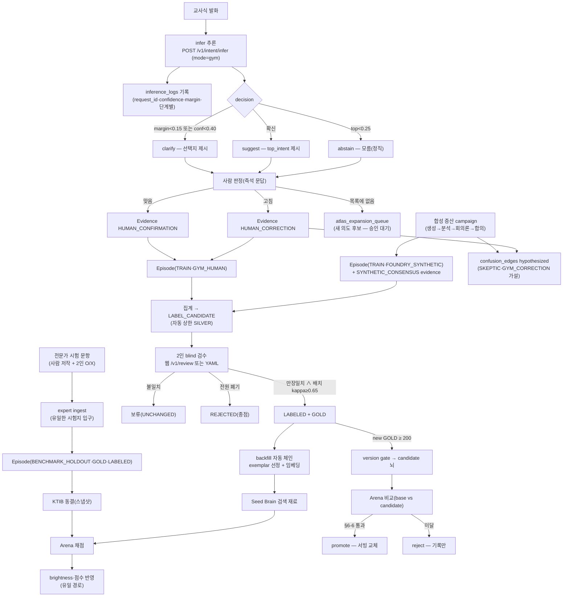
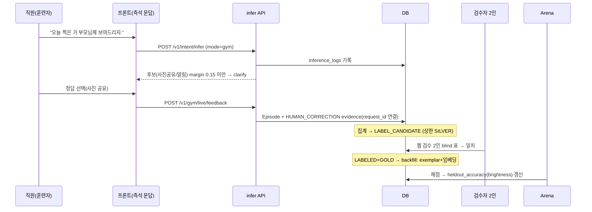

# 06. 데이터 생애주기 — 발화 한 문장이 뇌의 실력이 되기까지

> **한눈에 보기** — 데이터는 `발화 → 추론 → 사람 판정 → 증거(evidence) → 집계 → 2인 검수(GOLD) → 대표 예문 → (별도로) 시험지 동결 → 채점 → 승격` 순서로 흐른다. 어느 단계도 건너뛸 수 없게 DB 제약·상태기계·유일문(GOLD 승격 함수)이 강제한다. 이 장의 모든 화살표는 코드로 검증된 것만 그렸다.

---

## 1. 쉬운 설명 — 학교에 비유하면

1. 학생(뇌)이 문제(발화)를 풀어본다 — **추론**
2. 선생님(직원)이 맞았는지 알려준다 — **확인/교정 증거**
3. 교무회의(2인 검수)가 정답을 공식 확정한다 — **GOLD**
4. 확정된 정답이 교과서 예문이 된다 — **대표 예문(exemplar)**
5. 별도의 출제위원이 만든 시험지(KTIB)로만 성적을 매긴다 — **Arena**
6. 성적이 오른 학생만 진급한다 — **version gate 승격**

핵심: **문제집(TRAIN)과 시험지(BENCHMARK)는 절대 섞이지 않고**, 성적표(brightness)는 시험으로만 갱신된다.

---

## 2. 전체 흐름도 (코드 검증 기준)

---

## 3. 단계별 상세 (입력/출력/테이블/코드/조건)

### [1] 추론 (infer)
| | |
|---|---|
| 입력 | 발화 + workspace_context + recent_actions + teacher_context (Core — 훈련 메타 금지) |
| 출력 | intent_candidates(≤5)·top_intent·confidence·margin·decision·risk_level 등 |
| 쓰는 테이블 | inference_logs (판정 스냅샷 — request_id 인덱스) |
| 코드 | [근거: backend/app/api/infer.py::infer_endpoint, backend/app/brain/inference.py::infer(4단계: retrieval→scorer→prior→normalize), backend/app/brain/decision.py::decide] |
| 다음 조건 | decision이 execute/suggest/clarify/abstain — 임계값은 config만 [근거: config/experiments.yaml::decision] |
| 실패 시 | LLM 실패 → fallback_used=true, 후보 없음 → top_intent=UNKNOWN |
| 자동/수동 | 자동 |

### [2] 사람 판정 → 증거 (즉석 문답)
| | |
|---|---|
| 입력 | 추론 결과(후보 3~4) + 사람의 선택/교정/폐기 |
| 출력 | Episode(origin=GYM_HUMAN) + Evidence(HUMAN_CONFIRMATION/HUMAN_CORRECTION, `context.inference_request_id` 감사 연결) + **교정이면 혼동 가설 edge(정답→추측, GYM_CORRECTION)** |
| 쓰는 테이블 | episodes, evidence |
| 코드 | [근거: backend/app/api/gym.py::live feedback, backend/app/gym/live.py::record_training_feedback] |
| 다음 조건 | 신호 수 축적 → EVIDENCE_ACCUMULATING → LABEL_CANDIDATE (집계 상한 SILVER — GOLD 불가) [근거: backend/app/aggregator/aggregator.py "GOLD은 절대 반환하지 않는다"] |
| 분기 | "시험 문제로 출제" 토글 → **훈련 evidence로 가지 않고** 파일 대기열(blind)로만 [근거: backend/app/gym/live.py::queue_benchmark_candidate] · "목록에 없음" → atlas_expansion_queue(자동 등록 없음) |
| 자동/수동 | 판정은 수동, 저장·집계는 자동 |

### [3] 합성 증산 (campaign)
| | |
|---|---|
| 입력 | 시나리오·성향(seed) + 실 LLM |
| 출력 | Episode(FOUNDRY_SYNTHETIC, 상한 SILVER) + SYNTHETIC_CONSENSUS/DOMAIN_RULE evidence + Skeptic 혼동 가설 edge |
| 코드 | [근거: scripts/run_campaign.py, backend/app/foundry/pilot.py, backend/app/foundry/stages/s8_skeptic.py] |
| 다음 조건 | 품질 윈도(합의도·반려율·단가) 악화 시 자동 중단, 50건 배치 체크포인트 |
| 실패 시 | LLM 계약 위반 → 교정 재시도 1회 → 반복 위반 시 해당 건만 건너뜀(런 유지) [근거: backend/app/foundry/agents/runner.py::run_json_agent] |
| 자동/수동 | 실행 트리거만 수동(과금), 이후 자동 |

### [4] 2인 검수 → GOLD (유일문)
| | |
|---|---|
| 입력 | LABEL_CANDIDATE/REVIEW_REQUIRED 에피소드 + 서로 다른 2인의 독립 표 |
| 출력 | 만장일치 → LABELED+GOLD / 전원 폐기 → REJECTED / 불일치 → UNCHANGED |
| 게이트 | 배치 Cohen's kappa ≥ 0.65 미달 시 **배치 전량 거부**(부분 승격 없음) [근거: backend/app/aggregator/review.py::apply_review_batch, config::review.min_agreement_kappa] |
| 경로 | 웹 `/v1/review`(blind 큐 — 타인 표·집계 제안 비노출) 또는 `scripts/run_human_review.py --apply --commit` |
| 다음 | 성공 시 **backfill 자동 체인** — 대표 예문 선정+임베딩 [근거: backend/app/api/review.py::apply_votes, scripts/run_human_review.py] |
| 자동/수동 | 판정 수동, 승격·체인 자동 |

### [5] 대표 예문 (backfill)
- GOLD ∧ LABELED 에피소드만 대상, 기존 예문과 임베딩 거리 ≥ exemplar_min_dist(0.15)로 중복 방지, 멱등. [근거: backend/app/brain/backfill.py::select_exemplars, config::brain.exemplar_min_dist]
- **BENCHMARK_HOLDOUT은 제외** — 시험 문항이 교과서에 실리면 암기 측정이 된다(§8-2 격리, 테스트로 고정).

### [6] 시험지 경로 (TRAIN과 완전 분리)
- 유일 입구: expert ingest — 비합성 채널만, 2인 검수(kappa ≥ 0.65 **또는** O/X 관측 일치율 ≥ 0.80), TRAIN에 같은 발화 존재 시 거부(오염 방지). [근거: backend/app/foundry/expert_ingest.py::ingest_expert_episodes·_assert_no_train_contamination, config::review.min_expert_agreement]
- 물리 백스톱: `benchmark_integrity` CHECK — BENCHMARK_HOLDOUT ⇒ GOLD ∧ LABELED ∧ 비합성 채널. [근거: backend/app/models/episodes.py CHECK, CLAUDE.md 절대 규칙 2]
- 등록 후 KTIB **동결**(문항 스냅샷 + content_hash) — 이후 원본이 바뀌어도 시험지는 불변. [근거: backend/app/arena/ktib.py::build_ktib, backend/app/models/arena.py::KtibItem]
- 웹 업로드는 이력에 원문 보관: ktib_uploads. [근거: backend/app/api/observatory.py::ktib_upload]

### [7] 채점 → 반영 (Arena, brightness 유일 경로)
- 사전판정 4조건(하나라도 미달 시 버튼 회색+409): 실 provider / 동결 시험지 존재 / 지난 채점 후 새 유입 / **대표 예문 > 0**(아니면 0% 예정). [근거: backend/app/api/arena_ops.py::_blocked_reason]
- run_arena → reflect_arena_run만 heldout_accuracy(=brightness)·confusion 실측을 기록. 훈련·교정 코드는 접근 불가. [근거: backend/app/arena/reflect.py, backend/app/models/guards.py, CLAUDE.md 절대 규칙 3]

### [8] 승격 (version gate)
- new GOLD ≥ 200(min_new_gold) → candidate 뇌 빌드 → 같은 시험지로 base vs candidate → "global 상승 ∧ region 무회귀 ∧ critical 무악화" 통과 시에만 promote. [근거: scripts/run_version_gate.py, config::version_gate, backend/app/brain/version_gate.py]
- 서빙 버전 = 최신 promote — **reject 기록만으로 직전 버전으로 롤백**된다. [근거: backend/app/api/infer.py::_model_version]

---

## 4. 별도 분기 경로

| 분기 | 흐름 | 상태 |
|---|---|---|
| TRAIN 경로 | 위 [2][3][4][5] — 공부 재료 | IMPLEMENTED |
| BENCHMARK_HOLDOUT 경로 | [6] — 시험지. TRAIN과 해시·원문 대조로 상호 오염 차단 | IMPLEMENTED |
| atlas expansion | 분류 불능 발화 → atlas_expansion_queue(PENDING) → 사람 승인 시에만 온톨로지 확장 | IMPLEMENTED(큐)·수동 승인, 현재 0건 |
| adversarial | `adversarial=true` evidence는 자연 분포 집계에서 분리 | IMPLEMENTED(규칙·테스트), 현재 데이터 0건 [근거: DB 실측] |
| abstain·fallback | 모름/LLM 실패는 응답에 정직 표기 + 애매 발화 리포트로 집계 | IMPLEMENTED [근거: backend/app/api/observatory.py::ambiguity_report] |
| 위험 의도 실행 전 확인 | 응답의 requires_confirmation → 킨더버스 UI가 미리보기+확인(트랙 2) | 계약 IMPLEMENTED · UI DESIGNED |

---

## 5. 시퀀스 다이어그램 — 즉석 문답 한 건의 여정

## 현재 상태
- 파이프라인 전 구간 IMPLEMENTED. 현재 위치: [4] 앞 — 검수 대기 91건+, TRAIN GOLD 0, 대표 예문 0(그래서 [7]이 가드로 잠김). [근거: DB 스냅샷 2026-07-17]

## 주의사항
- label_state(워크플로)와 reliability_tier(품질)는 **별개 축**이다 — LABELED이면서 GOLD가 아닐 수 없게 별도 CHECK(gold_requires_labeled)도 있다.
- REJECTED는 종점이다(재검수 불가) — 폐기 표는 신중히.

## 다음 단계
- 단계별 실행 방법: [11-operations-guide.md](11-operations-guide.md) · 데이터 종류 상세: [05-data-catalog.md](05-data-catalog.md)
